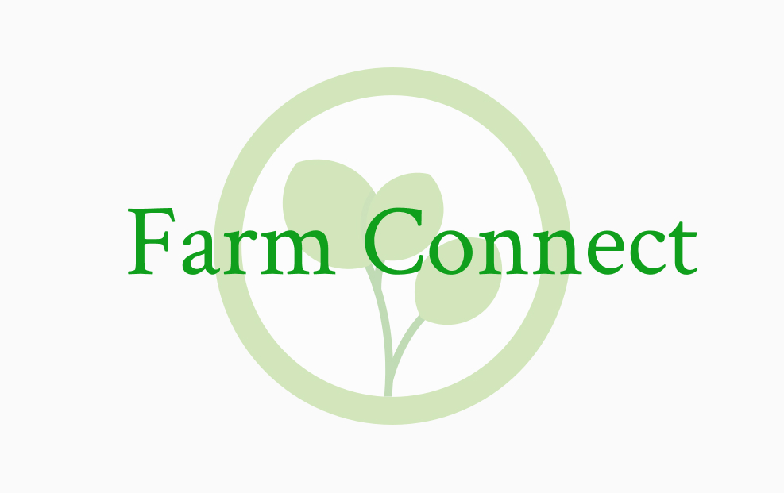

<p align="center">
  
</p>

# **Farm Connect**

Farm Connect is a web application designed to connect small-scale farmers directly with local consumers and businesses. By offering a digital platform for farmers to list and sell their produce, the platform aims to reduce food waste, support local agriculture, and provide consumers with access to fresh, locally-sourced products.

---

## **Table of Contents**

- [Project Overview](#project-overview)
- [Features](#features)
- [Technology Stack](#technology-stack)
- [System Architecture](#system-architecture)
- [Database Schema](#database-schema)
- [Installation](#installation)
- [Usage](#usage)
- [Roadmap](#roadmap)
- [Contributing](#contributing)
- [License](#license)

---

## **Project Overview**

Many small farmers face challenges connecting with consumers and businesses due to limited marketing resources and competition from larger corporations. **Farm Connect** provides a direct-to-consumer marketplace that supports local farmers by offering an accessible digital platform. This application allows farmers to manage product listings while enabling consumers to order fresh, affordable produce directly from local sources.

## **Features**

- **User Registration & Authentication**
  - Role-based accounts for farmers and consumers.
  - Secure login and session management.
  
- **Product Listings**
  - Farmers can create, view, edit, and delete their product listings.
  - Consumers can browse and view available products.
  
- **Shopping Cart & Checkout**
  - Users can add products to the cart, adjust quantities, and proceed to checkout.
  - Order tracking functionality allows users to view order status.

- **Order Management**
  - Both farmers and consumers can track and manage their order history.

- **Responsive Design**
  - Mobile and desktop-friendly layouts ensure an optimized user experience.

- **Security**
  - Features include session handling, input validation, and password hashing.

---

## **Technology Stack**

### **LAMP Stack**
- **Linux**: Operating system for hosting the application.
- **Apache**: Web server for serving the application.
- **MySQL**: Database for managing users, products, and orders.
- **PHP**: Backend scripting language for server-side functionality.

### **Frontend**
- **HTML/CSS/JavaScript**: Core technologies used for building the user interface and ensuring responsive design.

---

## **System Architecture**

Farm Connect follows a traditional LAMP architecture, with a clear separation between frontend and backend functionality. Here’s an overview:

1. **Frontend**: Built with HTML, CSS, and JavaScript to handle user interactions and provide a clean, intuitive interface.
2. **Backend**: PHP scripts manage CRUD operations for product management, user authentication, and order processing.
3. **Database**: A MySQL database stores essential data for users, products, and orders. Queries are managed through PHP to facilitate smooth data interaction.

---

## **Database Schema**

The database includes the following tables:

1. **Users**
   - Stores user information, including ID, name, email, password, and role (farmer or consumer).
   
2. **Products**
   - Contains product details, including product ID, farmer ID, name, price, stock, and description.
   
3. **Orders**
   - Tracks order information, linking consumers with product details and providing status updates.

---

## **Installation**

To set up Farm Connect on your local environment, follow these steps:

### 1. Install the LAMP Stack
   Ensure you have the LAMP stack installed, which includes:
   - **Linux**: Your operating system.
   - **Apache**: Web server.
   - **MySQL**: Database server.
   - **PHP**: Backend scripting language.

### 2. Clone the Repository
   Clone the project from GitHub to your local machine:
   ```bash
   git clone https://github.com/your-username/farm-connect.git
   cd farm-connect
